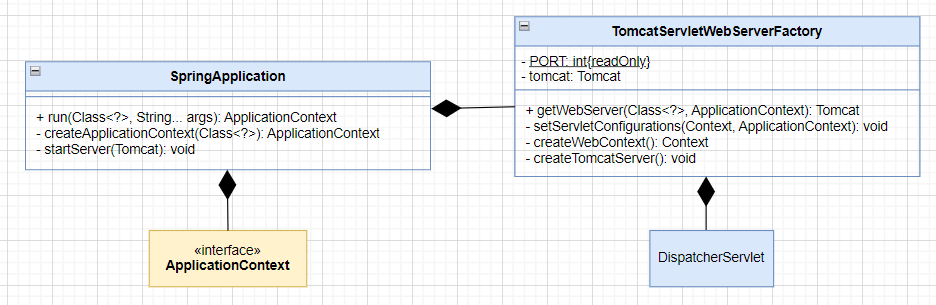
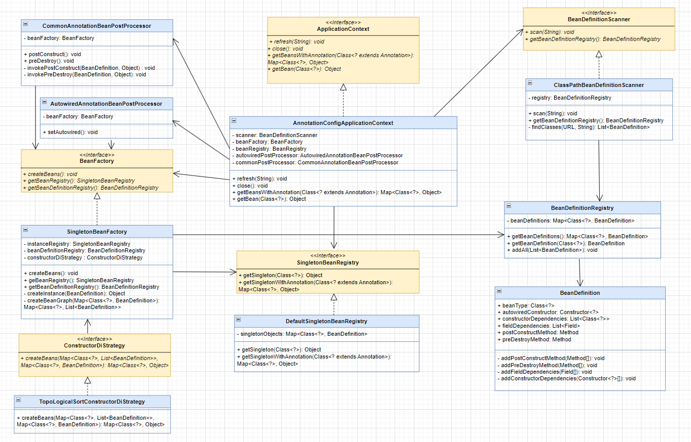
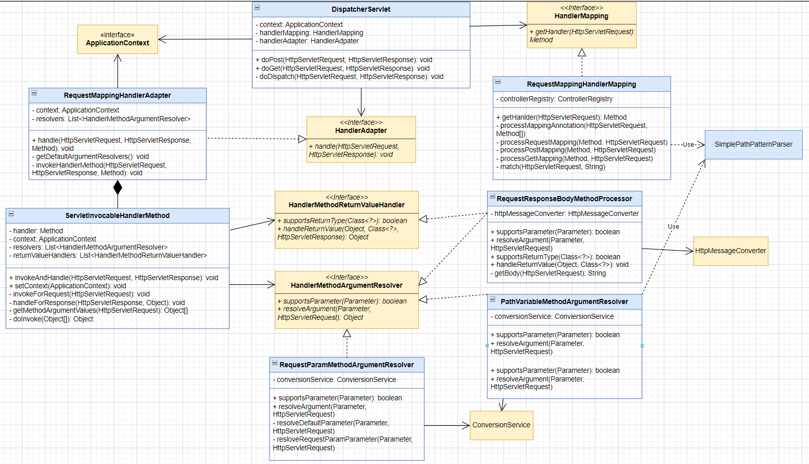
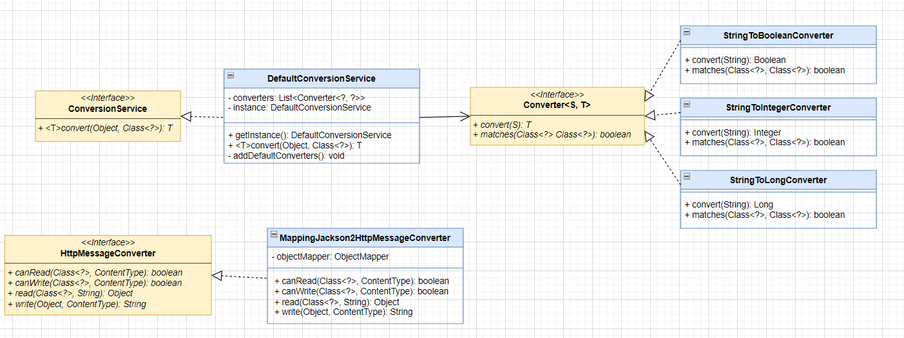
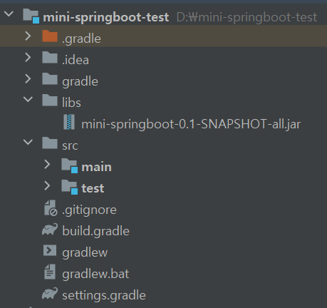
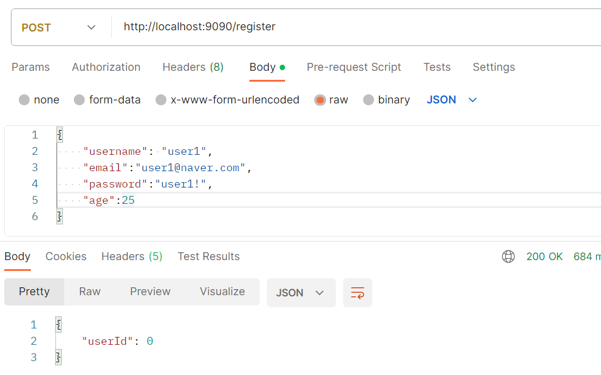
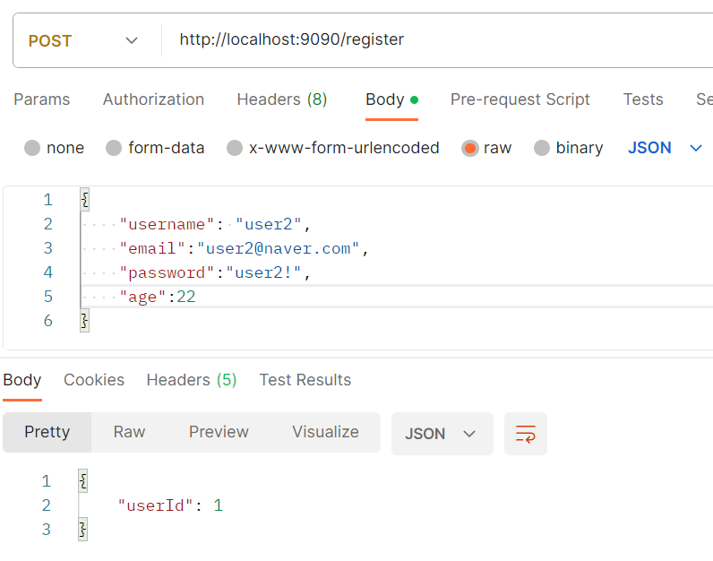
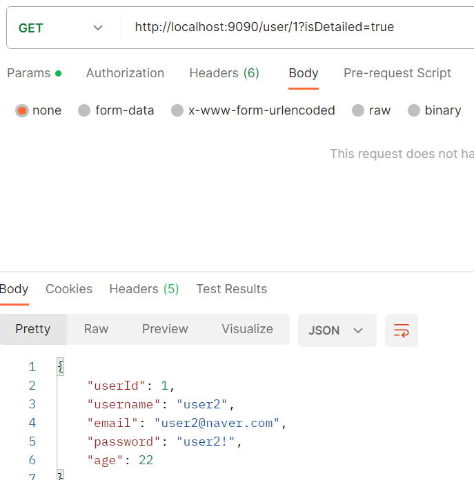
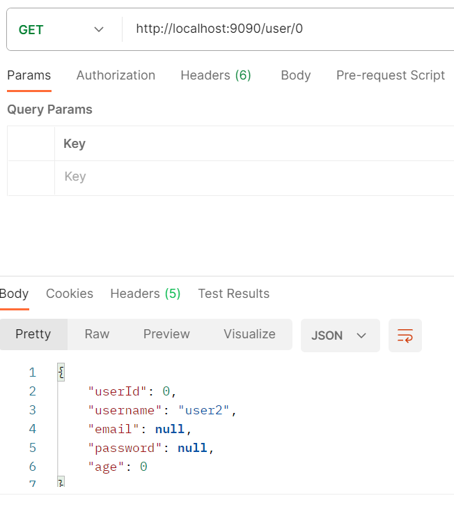
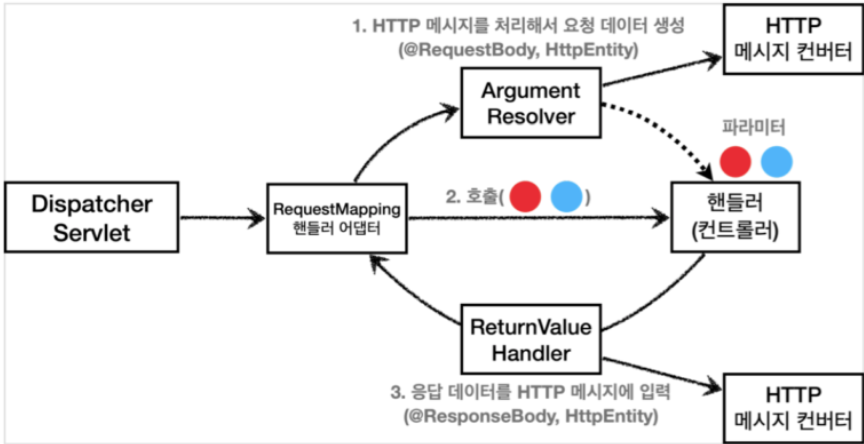

# Mini-SpringBoot 🌱
> ***SpringBoot는 사드세요.....***

2023년 2학기 플랫폼기반 프로그래밍 과제 기반 Java Reflection API를 이용하여 SpringBoot를 직접 구현해보는 프로젝트

# 1. 프로젝트 소개 🌱
2023년 2학기 플랫폼기반 프로그래밍에서 크게 다음과 같은 과제를 수행하였다.
1. Bean Validation 구현하기
2. Spring Container 구현하기
3. Dispatcher Servlet 구현하기
4. JPA Repository 구현하기

이 중 Spring Container, Dispatcher Servlet 구현했던 과제를 리팩토링하고 기능을 추가하여 **Mini-SpringBoot**를 구현하였다. 
리팩토링 시 여러 클래스로 분리하여 응집도를 향상하고 인터페이스에 의존하여 확장에 유연하게 만드는데 초점을 두었다.

# 2. 구현한 기능 🌱
## SpringApplication
- 기존 스프링부트 프로젝트처럼 아래와 같이 `run`을 실행하면 Spring Container가 초기화되고 Dispatcher Servlet이 활성화된다.
```java
@SpringBootApplication
public class Application {
	public static void main(String[] args) {
		SpringApplication.run(Application.class, args);
	}
}
```

## Spring Container
- @Controller, @Service, @Repository 어노테이션이 등록된 클래스는 **Singleton 빈을 생성**한다.
- 생성자와 필드에 @Autowired 어노테이션을 등록하면 **의존성을 자동으로 주입**한다.
- @PostConstruct와 @PreDestory 어노테이션으로 **생성한 직후와 소멸 직전 수행할 메서드를 정의**할 수 있다.

## Dispatcher Servlet
- @RequestMapping과 @GetMapping, @PostMapping으로 요청이 올 때 **적절한 메서드를 찾고 실행**해준다.
- @RequestBody, @RequestParam, @PathVariable을 지원하여 PathVariable, QueryString, 사용자 정의 클래스 등 **다양한 방법으로 메서드의 매개변수를 받을 수 있다.**"
- 위의 세가지 어노테이션을 지원하므로 URL의 쿼리 문자열, PathVariable 그리고 JSON 형식의 RequestBody를 처리할 수 있다.
- 실행 결과는 ResponseBody에 JSON 형식으로 반환한다.

## WAS
- 프로젝트에 내장된 WAS가 있어 요청을 보내고 받을 수 있다.

# 3. UML 🌱
## SpringApplication


## Spring Container


## Dispatcher Servlet


## Utils


구현 세부 사항은 하단의 **부록.구현 세부 사항**을 참고하세요.

# 4. 설치하기 🌱
## 1) JAR 파일 다운로드
- 현재 프로젝트의 터미널에서 `./gradlew shadowJar`을 실행하여 Jar 파일을 얻기
- 또는 [여기서](https://drive.google.com/file/d/1mb7PA5r0yQJnm8t9mQAwZIiAzvOKXgZv/view?usp=drive_link) 다운로드

만약 `./gradlew shadowJar`를 실행했을 때 sourceCompatibility = '17' 관련 오류가 생길 경우 [여기](https://stackoverflow.com/questions/31833029/intellij-idea-terminal-java-version-issue)를 참고하여 터미널의 JAVA_HOME 환경 변수를 변경하면 됩니다.

## 2) 프로젝트 만들기
JDK 버전을 17, 빌드 툴 gradle로 선택하여 새로운 자바 프로젝트를 생성한다.

## 3) JAR 파일 새로운 프로젝트에 넣기
프로젝트의 root 디렉토리에 libs 폴더를 생성하고 libs 폴더에 JAR 파일을 넣는다.


## 4) 새로운 프로젝트의 build.gradle 수정하기
build.gradle의 dependencies에 다음과 같은 코드를 추가한다.
```groovy
    implementation files('libs/mini-springboot-0.1-SNAPSHOT-all.jar')
```

다음과 같은 코드도 build.gradle에 추가한다.
```groovy
gradle.projectsEvaluated {
    tasks.withType(JavaCompile) {
        options.compilerArgs << "-parameters"
    }
}
```

## 5) 설치 완료
만약 여전히 @SpringBootApplication과 같은 어노테이션을 찾을 수 없다면 프로젝트를 종료한 후 다시 실행한다.

# 5. 실행 결과 🌱

## 실행하기

### 프로젝트 코드 작성하기
@SpringBootApplication 어노테이션이 붙고 SpringApplication.run을 실행하는 클래스의 패키지 하위에 Controller, Service, Repository 클래스를 생성한다.

### Postman으로 요청 보내기
현재 **프로젝트 Tomcat 서버의 포트는 9090**이므로 "http://localhost:9090/요청URL" 형태로 전송한다.

## 실행 결과
[샘플 프로젝트](https://github.com/MilkTea24/mini-springboot-sample)를 실행한 결과입니다.

### POST 결과
1. 첫번째 사용자 등록



2. 두번째 사용자 등록



### GET 결과
1. 두번째 사용자의 세부 정보 출력하기



2. 두번째 사용자의 간단한 정보 출력하기



# 부록. 구현 세부 사항 🌱
## SpringApplication 구현


### SpringApplication
SpringApplication의 `run` 메서드가 실행되면 `createApplicationContext` 메서드로 Spring Container를 초기화한다.
이후 TomcatServletWebServerFactory의 `getWebServer`가 실행되어 Tomcat 클래스를 반환하고 이 Tomcat을 실행하여 웹 어플리케이션이 실행된다.

### TomcatServletWebServerFactory
Tomcat 클래스의 생성과 설정을 담당한다.

## Spring Container 구현


### ApplicationContext, AnnotationConfigApplicationContext
컨테이너 기능을 가진 인터페이스와 이를 상속하는 클래스이다.
`refresh()` 메서드에서 빈 정의 -> 빈 생성 -> 의존관계 주입 -> 초기화 콜백 과정이 이루어진다. 

### BeanDefinitionScanner, ClassPathBeanDefinitionScanner
BasePackage 하위 패키지의 파일들을 탐색하여 @RestController, @Service, @Respository 어노테이션을 가진 클래스를 찾는다.
찾은 클래스는 @Autowired, @PostConstruct 등의 어노테이션이 존재하는지 조사하고 그 결과를 **BeanDefinition에 저장**한다.

### BeanFactory, SingletonBeanFactory
조사한 BeanDefinition을 바탕으로 빈을 생성한다.
빈을 생성하는 여러 방법 중 **하나의 타입 당 하나의 빈 만을 가지도록 하여** SingletonBeanFactory를 구현하였다.

### ConstructorDiStrategy, TopologicalSortConstructorDiStrategy
생성자 주입은 빈을 생성할 때 의존성이 같이 주입된다.
이 생성자 주입에 전략 패턴을 적용하여 필요에 따라 여러 방법을 구현하여 사용할 수 있도록 하였다.
현재 프로젝트에서는 **위상 정렬을 사용하여 각 빈들의 의존성을 확인하고 순환 참조를 방지할 수 있도록 설계**하였다.

### AutowiredAnnotationBeanPostProcessor
필드 주입인 경우 빈을 생성한 후 의존성이 주입된다.
따라서 BeanFactory가 빈을 생성하면 AutowiredAnnotationBeanPostProcessor가 필드 주입을 하도록 설계하였다.

### CommonAnnotationBeanPostProcessor
빈을 정의하는 첫 단계에서 @PostConstruct나 @PreDestroy 어노테이션을 가진 메서드가 존재하면 이를 BeanDefinition에 저장한다.
의존성 주입까지 끝난 이후 @PostConstruct가 붙은 메서드를 호출한다.
또한 `close()`가 호출되어 ApplicationContext가 종료될 때 @PreDestory 어노테이션을 가진 메서드를 실행하도록 하였다.

## Dispatcher Servlet 구현


### DispatcherServlet
Spring 컨테이너인 ApplicationContext를 보고 실행할 컨트롤러 메서드인 핸들러를 찾고 실행한다.
핸들러를 찾는 역할은 HandlerMapping에게, 핸들러를 실행하는 역할은 HandlerAdapter에게 위임한다.
실행한 결과는 HttpServletResponse에 담아 반환한다.

### HandlerMapping, RequestMappingHandlerMapping
`getHanlder` 메서드는 적절한 핸들러를 반환한다.
요청 URL과 @GetMapping, @PostMapping 패턴과의 일치 여부는 SimplePathPatternParser의 메서드를 호출하여 검증한다.

### HandlerAdapter, RequestMappingHandlerAdapter


출처: 김영한님 "스프링 MVC 1편 - 백엔드 웹 개발 핵심 기술" 강의 자료

`handle` 메서드에서 ServletInvocableHandlerMethod([실제 스프링 코드](https://github.com/spring-projects/spring-framework/blob/8137cc95669690f3e4055d6ccf484e98a07b6703/spring-webmvc/src/main/java/org/springframework/web/servlet/mvc/method/annotation/RequestMappingHandlerAdapter.java#L921))를 생성하여 request를 받고 response를 처리할 수 있도록 한다.

### ServletInvocableHandlerMethod
실질적인 메서드 실행을 담당하는 클래스이다.
메서드를 실행하기 전 각각의 파라미터에 대한 적절한 ArgumentResolver를 찾는다.
이후 ArgumentResolver에게 파라미터 처리를 위임하고 메서드를 실행한다.
메서드를 실행한 후 결과를 처리하기에 적절한 ReturnValueHandler를 찾는다.
이 후 ReturnValueHandler에게 결과 처리를 위임하고 반환한다.

### HandlerMethodArgumentResolver
사용자는 메서드를 실행하기 위한 정보를 다양한 방법(PathVariable, 쿼리 스트링 등)으로 전달한다.
이 다양한 정보들을 핸들러가 실행할 수 있게 정제해주는 역할을 가진 인터페이스가 HandlerMethodArgumentResolver이다.
`supportsParameter`는 현재 파라미터가 이 Resolver가 처리하기 적합한지 여부를 반환한다.
`resolveArgument`는 현재 파라미터를 Resolver가 처리하여 결과를 반환한다.
이 때 파라미터와 사용자가 전송한 데이터 타입과의 불일치는 **ConversionService**나 **HttpMessageConverter**를 이용하여 해결한다.
- RequestResponseBodyMethodProcessor : `@RequestBody`를 가진 파라미터를 처리한다.
- PathVariableMethodArgumentResolver : `@PathVariable`을 가진 파라미터를 처리한다.
- RequestParamMethodArgumentResolver : `@RequestParam`을 가진 파라미터를 처리한다.

### HandlerMethodReturnValueHandler, RequestResponseBodyMethodProcessor
RequestResponseBodyMethodProcessor는 실행한 결과를 ResponseBody에 담아주는 역할을 한다.
이 때 실행한 결과를 ResponseBody로 변환할 때 HttpMessageConverter를 활용한다.

## Utils 클래스들 구현


### ConversionService, DefaultConversionService
conversionService는 변환을 원하는 객체와 출력값을 알려주면 객체의 타입과 출력 타입을 판단하여 적절한 Converter를 호출한다.

### Converter
여러 Converter들이 구현되어 있으며 해당 객체의 타입을 출력 타입으로 변환해주는 기능을 가지고 있다.

### HttpMessageConverter, MappingJackson2HttpMessageConverter
`read`는 RequestBody와 같은 HttpMessage를 읽어 객체로 변환해준다.
`write`는 객체를 ResponseBody로 쓴다.
MappingJackson2HttpMessageConverter는 객체를 변환할 때 `com.fasterxml.jackson.databind.ObjectMapper`를 사용한다.