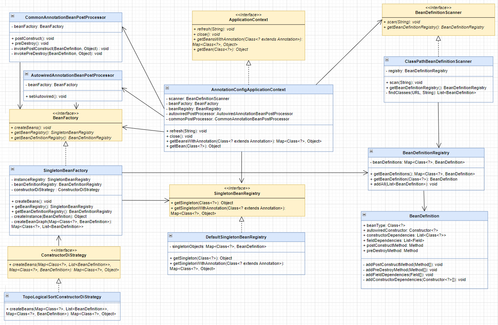

# Mini-SpringBoot
> ***SpringBoot는 사드세요.....***

2023년 2학기 플랫폼기반 프로그래밍 과제 기반 Java Reflection API를 이용하여 SpringBoot를 직접 구현해보는 프로젝트

# 1. 프로젝트 소개
2023년 2학기 플랫폼기반 프로그래밍에서 크게 다음과 같은 과제를 수행하였다.
1. Bean Validation 구현하기
2. Spring Container 구현하기
3. Dispatcher Servlet 구현하기
4. JPA Repository 구현하기

이 중 Spring Container, Dispatcher Servlet 구현했던 과제를 다듬고 기능을 추가하여 **Mini-SpringBoot**를 구현하였다. 
(나머지 두 과제도 다듬어서 기능 추가 예정)
Spring은 하나의 인터페이스에 다양한 구현체를 제공하지만 Mini-SpringBoot는 그 중 하나만을 간단하게 구현하고 있다.

기존의 하드코딩 되어 있는 많은 부분들을 수정하였다.
또한 이전에는 하나의 클래스에 수많은 기능이 존재하였는데 이를 여러 클래스로 분리하여 응집도를 향상시키기 위해 노력하였다.
그리고 클래스에 의존하는 대신 인터페이스에 의존하도록 최대한 수정하여 추후 확장에 유연하도록 수정하였다.

# 2. 구현한 기능
## Spring Container
- @Controller, @Service, @Repository 어노테이션이 등록된 클래스는 **Singleton 빈을 생성**한다.
- 생성자와 필드에 @Autowired 어노테이션을 등록하면 **의존성을 자동으로 주입**한다.
- @PostConstruct와 @PreDestory 어노테이션으로 **생성한 직후와 소멸 직전 수행할 메서드를 정의**할 수 있다.

## Dispatcher Servlet
- @RequestMapping과 @GetMapping, @PostMapping으로 요청이 올 때 **적절한 메서드를 찾고 실행**해준다.
- @RequestBody, @RequestParam, @PathVariable을 지원하여 PathVariable, QueryString, 사용자정의 클래스 등 **다양한 방법으로 메서드의 매개변수를 받을 수 있다.**

## WAS
- 프로젝트에 내장된 WAS가 있어 요청을 보내고 받을 수 있다.

# 3. 구현 세부 사항
## Spring Container 구현

### ApplicationContext, AnnotationConfigApplicationContext
컨테이너 기능을 가진 인터페이스와 이를 상속하는 클래스이다.
`refresh()` 메서드에서 빈 정의 -> 빈 생성 -> 의존관계 주입 -> 초기화 콜백 과정이 이루어진다. 

### BeanDefinitionScanner, ClassPathBeanDefinitionScanner
BasePackage 하위 패키지의 파일들을 탐색하여 @RestController, @Service, @Respository 어노테이션을 가진 클래스를 찾는다.
찾은 클래스는 @Autowired, @PostConstruct 등의 어노테이션이 존재하는지 조사하고 그 결과를 **BeanDefinition에 저장**한다.

## BeanFactory, SingletonBeanFactory
조사한 BeanDefinition을 바탕으로 빈을 생성한다.
빈을 생성하는 여러 방법 중 **하나의 타입 당 하나의 빈 만을 가지도록 하여** SingletonBeanFactory를 구현하였다.

## ConstructorDiStrategy, TopologicalSortConstructorDiStrategy
생성자 주입은 빈을 생성할 때 의존성이 같이 주입된다.
이 생성자 주입에 전략 패턴을 적용하여 필요에 따라 여러 방법을 구현하여 사용할 수 있도록 하였다.
현재 프로젝트에서는 **위상 정렬을 사용하여 각 빈들의 의존성을 확인하고 순환 참조를 방지할 수 있도록 설계**하였다.

## AutowiredAnnotationBeanPostProcessor
필드 주입인 경우 빈을 생성한 후 의존성이 주입된다.
따라서 BeanFactory가 빈을 생성하면 AutowiredAnnotationBeanPostProcessor가 필드 주입을 하도록 설계하였다.

## CommonAnnotationBeanPostProcessor
빈을 정의하는 첫 단계에서 @PostConstruct나 @PreDestroy 어노테이션을 가진 메서드가 존재하면 이를 BeanDefinition에 저장한다.
의존성 주입까지 끝난 이후 @PostConstruct가 붙은 메서드를 호출한다.
또한 `close()`가 호출되어 ApplicationContext가 종료될 때 @PreDestory 어노테이션을 가진 메서드를 실행하도록 하였다.

## Dispatcher Servlet 구현